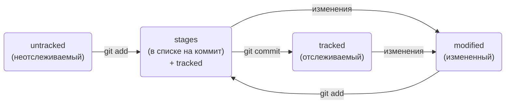

# Инструкция выполнения практической работы #1
# |. Создание репозитория Git на локальной машине
## 1. Инициализирем репозиторий
### Сделаем папку репозиторием  - ```git init```
Чтобы Git начал отслеживать изменения в проекте, папку с файлами этого проекта нужно сделать Git-репозиторием.

Для этого следует переместиться в неё и ввести команду ```git init```.

Я создаю папку second-project и делаю её Git-репозиторием: перейду в неё с помощью команды cd и выполню git init.

```
$ cd ~/dev/second-project
$ git init
```
Команда git init выведет сообщение вида Initialized empty Git repository in <*ваша папка с проектом*>/.git/ (англ. «инициализирован пустой Git-репозиторий в <*ваша папка*>/.git/»). В подпапке .git Git будет хранить всю служебную информацию.

----

### Проверяю состояние репозитория -  ```git status```
После инициализации репозитория ```second-project``` запускаю команду ```git status```  — она показывает текущее состояние репозитория.


Команда git status выведет:
* название текущей ветки: On branch master;
* сообщение о том, что в репозитории ещё нет коммитов: No commits yet;
* сообщение, которое говорит: «чтобы что-нибудь закоммитить (то есть зафиксировать), нужно сначала это создать» — nothing to commit (create/copy files and use "git add" to track).

## 2. Добавляем файлы в репозиторий
### Подготавливаю файлы к сохранению  - ```git add```

Добавим в репозиторий два файла. Например, файл todo.txt, и task.txt.

Создаю файлы ```todo.txt``` и ```task.txt``` в папке ```second-project``` и запускаю git status, чтобы посмотреть, что изменилось.

```
$ touch todo.txt
$ touch task.txt
# создали файлы todo.txt и task.txt

$ git status # проверили статус 
```

Состояние **untracked** значит, что Git ещё не хранит информацию о версиях файла и не может отследить, как он изменялся.

Сейчас в `first-project` два файла. Я хочу отслеживать состояние обоих, поэтому можем использовать команду git add --all. Ключ, или флаг, `--all` позволяет подготовить к сохранению все файлы в репозитории.
```
$ git add --all # подготовили к сохранению все файлы в репозитории
$ git status # проверили статус 
```
Получилось! Файлы, которые отмечены зелёным, теперь отслеживаются и готовы к сохранению. Но сохранения пока не произошло, потому что команда ```git add``` только запоминает текущее содержимое файла.


#### Чем отличается запоминание от сохранения?
 Команда ```git add``` не сохраняет содержимое файлов в репозитории. Само сохранение, или фиксацию состояния файлов, называют коммитом. «Сделать коммит» значит сохранить текущую версию файла.


 Если провести аналогию, команду ```git add``` можно сравнить с **добавлением товаров** в корзину в интернет-магазине, а ```коммит``` — с **оформлением и оплатой заказа**.

 Если сейчас отредактировать любой из «зелёных» файлов в папке *second-project*, он перейдёт в состояние *modified* и будет и в «зелёном», и в «красном» списках.

 Например, открою файл todo.txt и task.txt в редакторе и напишу в нём: *1. Просто файл для тренировки*.

 Сохраняю изменения, а затем снова вызоваю команду ```git status``` в консоли.

 Файлы ```todo.txt``` и  ```task.txt``` теперь есть и в «зелёном», и в «красном» списках:
зелёным отмечена пустая версия файла — в таком виде он был во время последнего запуска команды git add;


красным отмечена версия с текстом 1. Просто файл для тренировки.


Чтобы запомнить новое состояние файла, нужно снова ввести команду ```git add``` и передать в качестве параметра имя изменённого файла или ключ ```--all```.

```
$ git add todo.txt task.txt
# или
$ git add --all
```

Теперь файл ```todo.txt и task.txt``` снова готовы к сохранению! Будет сохранена последняя добавленная версия с текстом 1. Просто файл для тренировки.

## 3. Делаем первый коммит

**Коммит** — это одна из основных сущностей в Git (и в других системах контроля версий). Коммит гарантирует, что изменения будут сохранены в истории и при необходимости к ним можно будет «откатиться».

### Выполнить коммит  - ```git commit```

Сделать коммит можно командой ```git commit``` c ключом ```-m``` , который присваивает коммиту сообщение.

Обычно в таком сообщении поясняется, в чём именно состояли изменения. Это как заметки на полях: благодаря им проще читать и понимать текст. Сообщение коммита выполняет те же функции — улучшает понимание и упрощает навигацию. Оно пишется после ключа ```-m``` в кавычках.

Например, перейду в папку ```second-project``` и выполняю коммит со следующим комментарием.
```
$ git commit -m 'Мой первый коммит!' 
```
После нажатия ```Enter``` текущая версия файлов будет сохранена в репозитории с сообщением ```Мой первый коммит!```. Коммит — это по сути список файлов с их контентом.

Обратите внимание: после того как вы сделали первый коммит, команда ```git status``` перестала выводить сообщение ```No commits yet ```.

### Еще раз о разнице между  - ```git add``` и ```git commit```

Сначала команда ```git add``` сообщает Git, какие именно файлы нужно сохранить и какую их версию. Затем с помощью команды ```git commit``` происходит само сохранение. 

**Проведу аналогию с фотографией.** Сначала вы просите друзей встать в ряд — это команда ```git add```. И только после того, как все заняли свои места, поправили волосы и улыбнулись, вы нажимаете кнопку и делаете снимок — это команда ```git commit```. Сам получившийся снимок и будет коммитом. В нашем случае на этой фотографии с обратной стороны ещё есть подпись ```«Мой первый коммит!»```.

## 4. Просматриваем историю коммитов

### Просмотреть историю коммитов — ```git log```

Чтобы увидеть все коммиты, введите команду ```git log```.

Обратите внимание, что по умолчанию ```git log``` выводит коммиты в обратном хронологическом порядке — последние коммиты оказываются первыми сверху. В этом можно убедиться, если посмотреть на дату и время их создания.


Если после выполнения команды вы видите, что в репозитории есть только один коммит или их нет вообще, нужно убедитсяь, что ```git add``` и ```git commit``` были вызваны в нужном порядке.

# ||. Загрузка репозитория с локальной машины на GitHub.

## 1. Инструкция по созданию репозитория на GitHub.
1. Зайдите в свой профиль по ссылке https://github.com/username, где username — имя, которое вы указали при регистрации.

2. Создайте репозиторий. Для этого перейдите на вкладку Repositories, а затем нажмите на зелёную кнопку New справа.

3. Открылось окно создания нового репозитория. Назову его second-project. Название удалённого репозитория необязательно должно совпадать с именем папки проекта у вас на компьютере. Но чтобы не путаться, будем называть их одинаково.

Другие поля вам пока не понадобятся. Смело нажимайте на зелёную кнопку ```Create repository``` внизу.

Готово! Удалённый репозиторий создан. Страница с ним открывается автоматически.

Осталось связать удалённый репозиторий с локальным, который уже есть на вашем компьютере. GitHub предоставляет для этого инструкцию (пункт ```…or push an existing repository from the command line```).

## 2. Синхронизируем локальный и удаленный репозиторий.

Вы зарегистрировались на GitHub, сгенерировали SSH-ключ и привязали локальный репозиторий к удалённому. Самое сложное позади! Теперь разберём, как выкладывать свои правки на удалённый репозиторий. Но сначала немного о ветках.


### Отправить изменения на удалённый репозиторий — ```git push```

Мы уже прошли весь «цикл коммита»: подготовили файлы с помощью ```git add```, закоммитили их с комментарием командой ```git commit -m```. Осталось загрузить содержимое локального репозитория на GitHub. За это отвечает команда ```git push```.
```
$ git push -u origin main # Если команда приведёт к ошибке, попробуйте 
                          # заменить main на master. 
```


В дальнейшем при работе с удалённым репозиторием флаг ```-```u можно опустить и писать просто ```git push```.

# |||. Навигация по коммитам.

## 1. Хеш — идентификатор коммита.

В процессе работы с Git вам будет часто встречаться понятие «хеш коммита». Эти странные строчки с бессмысленным (на первый взгляд) набором букв и цифр вы могли видеть, когда вызывали команду ```git log``` и выводили историю коммитов.

### Что такое хеш. Хеширование коммитов

**Хеширование** — это способ преобразовать набор данных и получить их «отпечаток» (англ. fingerprint).


Информация о коммите — это набор данных: когда был сделан коммит, содержимое файлов в репозитории на момент коммита и ссылка на предыдущий, или родительский (англ. parent), коммит.


Git хеширует (преобразует) информацию о коммите с помощью алгоритма ```SHA-1``` (от англ. Secure Hash Algorithm — «безопасный алгоритм хеширования») и получает для каждого коммита свой уникальный хеш — результат хеширования.


Обычно хеш — это короткая ( 40 символов в случае SHA-1) строка, которая состоит из цифр 0—9 и латинских букв A—F (неважно, заглавных или строчных). Она обладает следующими важными свойствами:

*если хеш получить дважды для одного и того же набора входных данных, то результат будет гарантированно одинаковый;
*если хоть что-то в исходных данных поменяется (хотя бы один символ), то хеш тоже изменится (причём сильно).

### Хеш — основной идентификатор коммита

Git хранит таблицу соответствий ```хеш → информация о коммите```. Если вы знаете хеш, вы можете узнать всё остальное: автора и дату коммита и содержимое закоммиченных файлов. Можно сказать, что хеш — основной идентификатор коммита.


При работе с Git хеши будут встречаться вам регулярно. Их можно будет передавать в качестве параметра разным Git-командам, чтобы указать, с каким коммитом нужно произвести то или иное действие.


Все хеши и таблицу хеш → информация о коммите Git сохраняет в служебные файлы. Они находятся в скрытой папке ```.git``` в репозитории проекта.


## 2. Исследуем лог.

### Элементы описания коммита

После вызова ```git log``` появляется список коммитов.

Разберём элементы, из которых состоит описание:
* строка из цифр и латинских букв после слова commit — это хеш коммита;
* **Author** — имя автора и его электронная почта;
* **Date** — дата и время создания коммита;
*в конце находится сообщение коммита.

### Получить сокращённый лог — ```git log --oneline```

Получить сокращённый лог можно с помощью команды ```git log``` с флагом ```--oneline``` (англ. «одной строкой»). В терминале появятся только первые несколько символов хеша каждого коммита и их комментарии.

Сокращённый лог полезен, если в репозитории уже много коммитов — например, сотни или тысячи. В этом случае можно быстро найти нужный по описанию.


Сокращённый хеш (то есть первые несколько символов полного) можно использовать точно так же, как и полный. Для этого команда ```git log --oneline``` автоматически подбирает такую длину сокращённых хешей, чтобы они были уникальными в пределах репозитория и Git всегда мог понять, о каком коммите идёт речь.


 Обратите внимание: если выход из просмотра логов не произошёл автоматически, нажмите клавишу ```Q``` (от англ. Quit — «выйти») в английской раскладке клавиатуры.


## 3. HEAD.


При вызове команды ```git log``` вы также могли заметить надпись ```(HEAD -> master) ``` после хеша одного из коммитов. В этом уроке расскажем, что она означает.

### Файл HEAD.

Файл```HEAD``` (англ. «голова», «головной») — один из служебных файлов папки ```.git.``` Он указывает на коммит, который сделан последним (то есть на самый новый).

В этом можно убедиться с помощью терминала. Перейдите в папку ```.git``` командой ```cd```. Посмотрите содержимое файла ```HEAD``` командой ```cat```.
```
$ pwd # посмотрели, где мы
/Users/user/dev/first-project

$ cd .git/
$ ls # посмотрели, какие есть файлы
COMMIT_EDITMSG  ORIG_HEAD  description  index  logs/     refs/
HEAD            config     hooks/       info/  objects/

$ cat HEAD # команда cat показывает содержимое файла
ref: refs/heads/master # в файле вот такая ссылка 
```

Внутри ```HEAD``` — ссылка на служебный файл: ```refs/heads/master``` в зависимости от названия ветки). Если заглянуть в этот файл, можно увидеть хеш последнего коммита.
```
$ cat refs/heads/master # взяли ссылку из файла HEAD
# внутри хеш
e007f5035f113f9abca78fe2149c593959da5eb7

$ git log 
# сверяем с хешем последнего коммита
commit e007f5035f113f9abca78fe2149c593959da5eb7
Author: John Doe <johndoe@example.com>
Date:   Tue Mar 28 00:26:53 2023 +0300

    Добавить амбиций в список дел

... # другие коммиты 
```

Когда вы делаете коммит, Git обновляет ```refs/heads/master``` — записывает в него хеш последнего коммита. Получается, что ```HEAD``` тоже обновляется, так как ссылается на refs/heads/master.


При работе с Git указатель ```HEAD``` используется довольно часто. Мы уже упоминали, что многие команды Git принимают в качестве параметра хеш коммита. Если нужно передать последний коммит, то вместо его хеша можно просто написать слово ```HEAD``` — Git поймёт, что вы имели в виду последний коммит.

## 4. Статусы файлов в Git.

До появления Git системы контроля версий выделяли только два статуса у файлов: «уже закоммичен» и «ещё не закоммичен». Например, в Subversion (самой популярной VCS до эпохи Git) не нужно было выполнять команду — аналог ```git add```, а можно было просто сделать коммит (```svn commit```). Эта команда по умолчанию добавляла в коммит все новые и изменённые файлы.


Такое поведение интуитивно более понятно. Зато Git даёт больше контроля за состоянием файлов. Хотя сначала это может показаться сложным, со временем вы оцените удобство более явного подхода.

### Статусы ```untracked/tracked```, ```staged и modified```.

Одна из ключевых задач Git — отслеживать изменения файлов в репозитории. Для этого каждый файл помечается каким-либо статусом. Рассмотрим основные.


* **untracked** (англ. «неотслеживаемый»)

    Мы говорили, что новые файлы в Git-репозитории помечаются как ```untracked```, то есть неотслеживаемые. Git «видит», что такой файл существует, но не следит за изменениями в нём. У untracked-файла нет предыдущих версий, зафиксированных в коммитах или через команду ```git add```.
* **staged** (англ. «подготовленный»)
  После выполнения команды ```git add``` файл попадает в **staging area** (от англ. stage — «сцена», «этап [процесса]» и area — «область»), то есть в список файлов, которые войдут в коммит. В этот момент файл находится в состоянии ```staged```.
 
 
  В одном из предыдущих уроков мы сравнили коммит с фотографией. Можно развить эту аналогию и сказать, что команда ```git add``` добавляет персонажей (текущее содержимое файла или нескольких файлов) на сцену (англ. stage) для общей фотографии, а ```git commit``` делает снимок всей сцены целиком. 

### Staging area, index и cache.

Staging area также называют **index** (англ. «каталог») или **cache** (англ. «кеш»), а состояние файла ```staged``` иногда называют ```indexed``` или ```cached```.
Все три варианта могут встречаться в документации и в качестве флагов команд Git. 

* **tracked** (англ. «отслеживаемый»)

    Состояние ```tracked``` — это противоположность ```untracked```. Оно довольно широкое по смыслу: в него попадают файлы, которые уже были зафиксированы с помощью ```git commit```, а также файлы, которые были добавлены в ```staging area``` командой ```git add```. То есть все файлы, в которых Git так или иначе отслеживает изменения.
* **modified** (англ. «изменённый»)

    Состояние ```modified``` означает, что Git сравнил содержимое файла с последней сохранённой версией и нашёл отличия. Например, файл был закоммичен и после этого изменён.

Для файлов в состояниях ```staged``` и ```modified``` обычно не указывают, что они также tracked, потому что это состояние подразумевается.

### Про ```staged``` и ```modified```.

Команда ```git add``` добавляет в *staging area* только текущее содержимое файла. Если вы, например, сделаете ```git add file.txt```, а затем измените ```file.txt```, то новое содержимое файла не будет находиться в *staging*.

Git сообщит об этом с помощью статуса *modified*: файл изменён относительно той версии, которая уже в *staging*. Чтобы добавить в *staging* последнюю версию, нужно выполнить ```git add file.txt``` ещё раз.

### Типичный жизненный цикл файла в Git.

Может показаться, что файлы в репозитории попадают в разные состояния хаотично. На практике это не так, и у большинства файлов вполне предсказуемый путь.



1. Файл только что создали. Git ещё не отслеживает содержимое этого файла. Состояние: ``untracked``.

2. Файл добавили в staging area с помощью ``git add``. Состояние: ``staged`` (+ ``tracked``).
* Возможно, изменили файл ещё раз. Состояния: ``staged``, ``modified`` (+ ``tracked``).

    Обратите внимание: staged и modified у одного файла, но у разных его версий.


* Ещё раз выполнили ``git add``. Состояние: ``staged`` (+ ``tracked``).
3. Сделали коммит с помощью ``git commit``. Состояние: ``tracked``.
4. Изменили файл. Состояние: ``modified`` (+ ``tracked``).
5. Снова добавили в ``staging area`` с помощью ``git add``. Состояния: ``staged`` (+ ``tracked``).
6. Сделали коммит. Состояния: ``tracked``.
7. Повторили пункты 

## 5. Как читать git status.

Частая ошибка при использовании Git — закоммитить лишнее или, наоборот, забыть добавить важный файл в коммит. Этого легко избежать, если не забывать проверять статусы файлов с помощью команды ``git status``. Как читать её вывод, покажем в этом уроке.

### Какие состояния показывает ```git status```.

Большинство файлов в типичном проекте будут находиться в состоянии ```tracked``` (то есть закоммичены и не изменены после коммита). Вы не увидите это состояние в выводе команды ```git status``` — иначе она бы каждый раз выводила список вообще всех файлов проекта.

В итоге ```git status``` показывает только следующие состояния файлов:
* ```staged``` (```Changes to be committed``` в выводе ```git status```);
* ```modified``` (```Changes not staged for commit```);
* ```untracked``` (```Untracked files```).

### Подготавливаем репозиторий.

Чтобы попрактиковаться, инициализируйте новый репозиторий ```~/dev/git-status-lesson```. Создайте в нём файл ```README.md``` и закоммитьте его.
```
$ cd ~/dev
$ mkdir git-status-lesson
$ cd git-status-lesson
$ git init
# тут Git выведет что-нибудь, но мы это пропустим
$ touch README.md
$ git add README.md
$ git commit -m 'Добавить README'
~~~~# по традиции первым создадим и закоммитим файл README.md
```

Дальше вы будете добавлять в репозиторий файлы и смотреть на их статусы.

### Типичные варианты вывода ```git status```.

#### 1. Нет ни ```staged-```, ни ```modified-```, ни ```untracked```-файлов.

Если ничего не менять в ```git-status-lesson``` после первого коммита, то в нём не должно быть ни изменённых файлов (```modified```), ни новых (```untracked```), ни добавленных в список на коммит (```staged```). Вызовите команду ```git status```. Её вывод будет примерно таким.

```
$ git status
On branch master
nothing to commit, working tree clean  
```

Это означает, что в репозитории нет новых или изменённых файлов. Последняя строка ```nothing to commit, working tree clean``` буквально переводится как «нечего коммитить, рабочая директория чиста».

#### 2. Найдены неотслеживаемые файлы.

Создайте в папке ```~/dev/git-status-lesson файл fileA.txt```. Теперь в репозитории есть новый файл в состоянии ```untracked```. Снова вызовите команду ```git status```. Результат будет таким.

```
$ touch fileA.txt
$ git status
On branch master
Untracked files: # найдены неотслеживаемые файлы
  (use "git add <file>..." to include in what will be committed)
        fileA.txt

nothing added to commit but untracked files present (use "git add" to track) 
```

Файл ```fileA.txt``` отображается в секции неотслеживаемых файлов — ```Untracked files```. Это значит, что он не был добавлен в репозиторий через ```git add```.

Обратите внимание: в самом выводе ```git status``` есть подсказка, какую команду использовать, чтобы добавить файл в список на коммит: ```Use git add <file> to include in what will be committed``` (англ. «используйте ```git add <file>```, чтобы добавить в список на коммит»).

Добавьте ```fileA.txt``` в ```staging area``` с помощью ```git add``` и снова запросите ```git status```.

```
$ git add fileA.txt 
$ git status
On branch master
Changes to be committed: # новая секция
  (use "git restore --staged <file>..." to unstage)
        new file:   fileA.txt 
```

В этот раз ```git status подсказывает```, что существует команда ```git restore```. Мы познакомим вас с ней в одном из будущих уроков.

Теперь ```fileA.txt``` находится в секции ```Changes to be committed``` (англ. «изменения, которые попадут в коммит»). Если сейчас выполнить коммит, то в репозитории будет зафиксирована текущая версия этого файла. Закоммитьте его.

```
$ git commit -m 'Добавить файл fileA.txt'
# тут будет вывод комманды commit, он нас не интересует
$ git status
On branch master
nothing to commit, working tree clean 
```

Вывод команды ```git status``` такой же, какой был после первого коммита: «Директория чиста».

#### 3. Найдены изменения, которые не войдут в коммит.

Теперь откройте файл ```fileA.txt``` и добавьте в него несколько слов — например, ```Это файл A!```. Сохраните ```fileA.txt``` и вызовите команду ```git status```. Её результат будет такой.

```
# внесли в fileA.txt правки
# запросили статус
$ git status 
On branch master
Changes not staged for commit: # ещё одна секция
  (use "git add <file>..." to update what will be committed)
  (use "git restore <file>..." to discard changes in working directory)
        modified:   fileA.txt 
```

Файл ```fileA.txt``` был изменён, но ещё не добавлен в ```staging area``` после этого. Так он оказался в секции ```Changes not staged for commit``` (англ. «изменения, которые не подготовлены к коммиту»). Эта секция соответствует статусу ```modified```.


Подготовьте правки к коммиту с помощью ```git add```.

```
$ git add fileA.txt
$ git status
On branch master
Changes to be committed: # все изменения готовы к коммиту
  (use "git restore --staged <file>..." to unstage)
        modified:   fileA.txt 
```

Теперь в коммит попадёт уже новая версия файла ```fileA.txt```.

Обратите внимание: хотя вывод команды ```git status``` очень похож на тот, который был после первого добавления файла ```fileA.txt```, они всё же отличаются.


Когда совсем новый файл попадает в ```staging area```, перед его названием указывается ```new file```. Вот так: ```new file: fileA.txt```.


Если файл уже однажды попадал в историю (с помощью коммита) и был изменён, после выполнения ```git add``` он будет записан уже так: ```modified: fileA.txt```.

#### 4. Файл добавлен в staging area, но после этого изменён.

Вы добавили файл в ```staging area```, но перед самым коммитом вспомнили важную мелочь. Например, вместо одного восклицательного знака в конце строки ```Это файл A!``` нужно поставить три.


Откройте текстовый редактор и добавьте нужные правки. Теперь можно выполнить коммит, но в любой непонятной ситуации сначала стоит вызвать ```git status```. Он покажет следующее.

```
# изменили fileA.txt
$ git status
On branch master
Changes to be committed:
  (use "git restore --staged <file>..." to unstage)
          modified:   fileA.txt

Changes not staged for commit:
  (use "git add <file>..." to update what will be committed)
  (use "git restore <file>..." to discard changes in working directory)
          modified:   fileA.txt
```

Файл попал и в ```staged``` (```Changes to be committed```), и в ```modified``` (```Changes not staged for commit```). В ```staging area``` находится версия файла с одним восклицательным знаком, а в ```Changes not staged for commit``` — уже изменённая версия, с тремя.


Чтобы закоммитить самую свежую версию файла, нужно снова выполнить ```git add``` перед коммитом.


Теперь проверьте, как вы усвоили материал урока! Изучите скриншот с выводами команды ```git status``` для репозитория ```quiz-project```.
