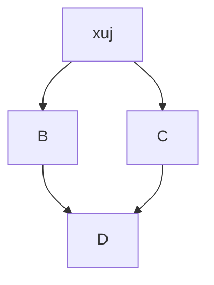

# Инструкция выполнения практической работы #1
# |. Создание репозитория Git на локальной машине
## 1. Инициализирем репозиторий
### Сделаем папку репозиторием  - ```git init```
Чтобы Git начал отслеживать изменения в проекте, папку с файлами этого проекта нужно сделать Git-репозиторием.

Для этого следует переместиться в неё и ввести команду ```git init```.

Я создаю папку second-project и делаю её Git-репозиторием: перейду в неё с помощью команды cd и выполню git init.

```
$ cd ~/dev/second-project
$ git init
```
Команда git init выведет сообщение вида Initialized empty Git repository in <*ваша папка с проектом*>/.git/ (англ. «инициализирован пустой Git-репозиторий в <*ваша папка*>/.git/»). В подпапке .git Git будет хранить всю служебную информацию.

----

### Проверяю состояние репозитория -  ```git status```
После инициализации репозитория ```second-project``` запускаю команду ```git status```  — она показывает текущее состояние репозитория.


Команда git status выведет:
* название текущей ветки: On branch master;
* сообщение о том, что в репозитории ещё нет коммитов: No commits yet;
* сообщение, которое говорит: «чтобы что-нибудь закоммитить (то есть зафиксировать), нужно сначала это создать» — nothing to commit (create/copy files and use "git add" to track).

## 2. Добавляем файлы в репозиторий
### Подготавливаю файлы к сохранению  - ```git add```

Добавим в репозиторий два файла. Например, файл todo.txt, и task.txt.

Создаю файлы ```todo.txt``` и ```task.txt``` в папке ```second-project``` и запускаю git status, чтобы посмотреть, что изменилось.

```
$ touch todo.txt
$ touch task.txt
# создали файлы todo.txt и task.txt

$ git status # проверили статус 
```

Состояние **untracked** значит, что Git ещё не хранит информацию о версиях файла и не может отследить, как он изменялся.

Сейчас в `first-project` два файла. Я хочу отслеживать состояние обоих, поэтому можем использовать команду git add --all. Ключ, или флаг, `--all` позволяет подготовить к сохранению все файлы в репозитории.
```
$ git add --all # подготовили к сохранению все файлы в репозитории
$ git status # проверили статус 
```
Получилось! Файлы, которые отмечены зелёным, теперь отслеживаются и готовы к сохранению. Но сохранения пока не произошло, потому что команда ```git add``` только запоминает текущее содержимое файла.


#### Чем отличается запоминание от сохранения?
 Команда ```git add``` не сохраняет содержимое файлов в репозитории. Само сохранение, или фиксацию состояния файлов, называют коммитом. «Сделать коммит» значит сохранить текущую версию файла.


 Если провести аналогию, команду ```git add``` можно сравнить с **добавлением товаров** в корзину в интернет-магазине, а ```коммит``` — с **оформлением и оплатой заказа**.

 Если сейчас отредактировать любой из «зелёных» файлов в папке *second-project*, он перейдёт в состояние *modified* и будет и в «зелёном», и в «красном» списках.

 Например, открою файл todo.txt и task.txt в редакторе и напишу в нём: *1. Просто файл для тренировки*.

 Сохраняю изменения, а затем снова вызоваю команду ```git status``` в консоли.

 Файлы ```todo.txt``` и  ```task.txt``` теперь есть и в «зелёном», и в «красном» списках:
зелёным отмечена пустая версия файла — в таком виде он был во время последнего запуска команды git add;


красным отмечена версия с текстом 1. Просто файл для тренировки.


Чтобы запомнить новое состояние файла, нужно снова ввести команду ```git add``` и передать в качестве параметра имя изменённого файла или ключ ```--all```.

```
$ git add todo.txt task.txt
# или
$ git add --all
```

Теперь файл ```todo.txt и task.txt``` снова готовы к сохранению! Будет сохранена последняя добавленная версия с текстом 1. Просто файл для тренировки.

## 3. Делаем первый коммит

**Коммит** — это одна из основных сущностей в Git (и в других системах контроля версий). Коммит гарантирует, что изменения будут сохранены в истории и при необходимости к ним можно будет «откатиться».

### Выполнить коммит  - ```git commit```

Сделать коммит можно командой ```git commit``` c ключом ```-m``` , который присваивает коммиту сообщение.

Обычно в таком сообщении поясняется, в чём именно состояли изменения. Это как заметки на полях: благодаря им проще читать и понимать текст. Сообщение коммита выполняет те же функции — улучшает понимание и упрощает навигацию. Оно пишется после ключа ```-m``` в кавычках.

Например, перейду в папку ```second-project``` и выполняю коммит со следующим комментарием.
```
$ git commit -m 'Мой первый коммит!' 
```
После нажатия ```Enter``` текущая версия файлов будет сохранена в репозитории с сообщением ```Мой первый коммит!```. Коммит — это по сути список файлов с их контентом.

Обратите внимание: после того как вы сделали первый коммит, команда ```git status``` перестала выводить сообщение ```No commits yet ```.

### Еще раз о разнице между  - ```git add``` и ```git commit```

Сначала команда ```git add``` сообщает Git, какие именно файлы нужно сохранить и какую их версию. Затем с помощью команды ```git commit``` происходит само сохранение. 

**Проведу аналогию с фотографией.** Сначала вы просите друзей встать в ряд — это команда ```git add```. И только после того, как все заняли свои места, поправили волосы и улыбнулись, вы нажимаете кнопку и делаете снимок — это команда ```git commit```. Сам получившийся снимок и будет коммитом. В нашем случае на этой фотографии с обратной стороны ещё есть подпись ```«Мой первый коммит!»```.

## 4. Просматриваем историю коммитов

### Просмотреть историю коммитов — ```git log```

Чтобы увидеть все коммиты, введите команду ```git log```.

Обратите внимание, что по умолчанию ```git log``` выводит коммиты в обратном хронологическом порядке — последние коммиты оказываются первыми сверху. В этом можно убедиться, если посмотреть на дату и время их создания.


Если после выполнения команды вы видите, что в репозитории есть только один коммит или их нет вообще, нужно убедитсяь, что ```git add``` и ```git commit``` были вызваны в нужном порядке.

# ||. Загрузка репозитория с локальной машины на GitHub.

## 1. Инструкция по созданию репозитория на GitHub.
1. Зайдите в свой профиль по ссылке https://github.com/username, где username — имя, которое вы указали при регистрации.

2. Создайте репозиторий. Для этого перейдите на вкладку Repositories, а затем нажмите на зелёную кнопку New справа.

3. Открылось окно создания нового репозитория. Назову его second-project. Название удалённого репозитория необязательно должно совпадать с именем папки проекта у вас на компьютере. Но чтобы не путаться, будем называть их одинаково.

Другие поля вам пока не понадобятся. Смело нажимайте на зелёную кнопку ```Create repository``` внизу.

Готово! Удалённый репозиторий создан. Страница с ним открывается автоматически.

Осталось связать удалённый репозиторий с локальным, который уже есть на вашем компьютере. GitHub предоставляет для этого инструкцию (пункт ```…or push an existing repository from the command line```).

## 2. Синхронизируем локальный и удаленный репозиторий.

Вы зарегистрировались на GitHub, сгенерировали SSH-ключ и привязали локальный репозиторий к удалённому. Самое сложное позади! Теперь разберём, как выкладывать свои правки на удалённый репозиторий. Но сначала немного о ветках.


### Отправить изменения на удалённый репозиторий — ```git push```

Мы уже прошли весь «цикл коммита»: подготовили файлы с помощью ```git add```, закоммитили их с комментарием командой ```git commit -m```. Осталось загрузить содержимое локального репозитория на GitHub. За это отвечает команда ```git push```.
```
$ git push -u origin main # Если команда приведёт к ошибке, попробуйте 
                          # заменить main на master. 
```


В дальнейшем при работе с удалённым репозиторием флаг ```-```u можно опустить и писать просто ```git push```.

# |||. Навигация по коммитам.

## 1. Хеш — идентификатор коммита.

В процессе работы с Git вам будет часто встречаться понятие «хеш коммита». Эти странные строчки с бессмысленным (на первый взгляд) набором букв и цифр вы могли видеть, когда вызывали команду ```git log``` и выводили историю коммитов.

### Что такое хеш. Хеширование коммитов

**Хеширование** — это способ преобразовать набор данных и получить их «отпечаток» (англ. fingerprint).


Информация о коммите — это набор данных: когда был сделан коммит, содержимое файлов в репозитории на момент коммита и ссылка на предыдущий, или родительский (англ. parent), коммит.


Git хеширует (преобразует) информацию о коммите с помощью алгоритма ```SHA-1``` (от англ. Secure Hash Algorithm — «безопасный алгоритм хеширования») и получает для каждого коммита свой уникальный хеш — результат хеширования.


Обычно хеш — это короткая ( 40 символов в случае SHA-1) строка, которая состоит из цифр 0—9 и латинских букв A—F (неважно, заглавных или строчных). Она обладает следующими важными свойствами:

*если хеш получить дважды для одного и того же набора входных данных, то результат будет гарантированно одинаковый;
*если хоть что-то в исходных данных поменяется (хотя бы один символ), то хеш тоже изменится (причём сильно).

### Хеш — основной идентификатор коммита

Git хранит таблицу соответствий ```хеш → информация о коммите```. Если вы знаете хеш, вы можете узнать всё остальное: автора и дату коммита и содержимое закоммиченных файлов. Можно сказать, что хеш — основной идентификатор коммита.


При работе с Git хеши будут встречаться вам регулярно. Их можно будет передавать в качестве параметра разным Git-командам, чтобы указать, с каким коммитом нужно произвести то или иное действие.


Все хеши и таблицу хеш → информация о коммите Git сохраняет в служебные файлы. Они находятся в скрытой папке ```.git``` в репозитории проекта.


## 2. Исследуем лог.

### Элементы описания коммита

После вызова ```git log``` появляется список коммитов.

Разберём элементы, из которых состоит описание:
* строка из цифр и латинских букв после слова commit — это хеш коммита;
* **Author** — имя автора и его электронная почта;
* **Date** — дата и время создания коммита;
*в конце находится сообщение коммита.

### Получить сокращённый лог — ```git log --oneline```

Получить сокращённый лог можно с помощью команды ```git log``` с флагом ```--oneline``` (англ. «одной строкой»). В терминале появятся только первые несколько символов хеша каждого коммита и их комментарии.

Сокращённый лог полезен, если в репозитории уже много коммитов — например, сотни или тысячи. В этом случае можно быстро найти нужный по описанию.


Сокращённый хеш (то есть первые несколько символов полного) можно использовать точно так же, как и полный. Для этого команда ```git log --oneline``` автоматически подбирает такую длину сокращённых хешей, чтобы они были уникальными в пределах репозитория и Git всегда мог понять, о каком коммите идёт речь.


 Обратите внимание: если выход из просмотра логов не произошёл автоматически, нажмите клавишу ```Q``` (от англ. Quit — «выйти») в английской раскладке клавиатуры.


